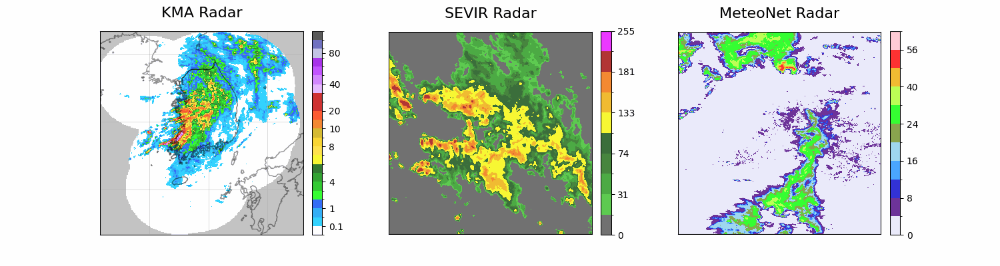
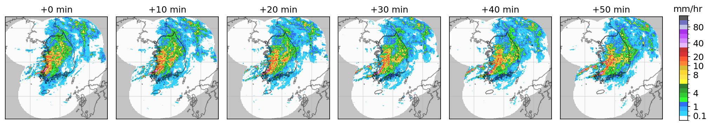
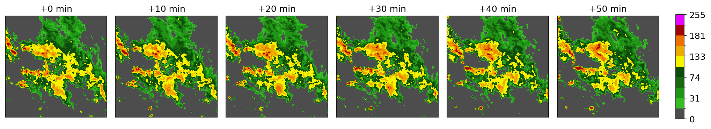
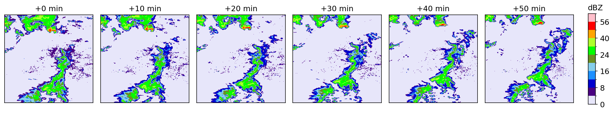

# 🛰️ Processing Radar Datasets

This repository provides a detailed explanation of how radar datasets are processed for use in **precipitation forecasting** tasks.  
The processed datasets can be utilized for **training**, **benchmarking**, and **evaluating** various precipitation forecasting models.

---

### 📦 Available Datasets

The following three radar datasets are covered in this repository:

- [**Korea Meteorological Administration (KMA)**](#️-kma-dataset)
- [**SEVIR**](#️-sevir-dataset)
- [**MeteoNet**](#️-meteonet-dataset)

---

### 📊 Visualizations



---

## 🌧️ KMA Dataset
The [Korea Meteorological Administration (KMA)](https://data.kma.go.kr/) dataset provides nationwide radar coverage for South Korea, including multiple types of radar reflectivity such as Plan-Position Indicator (PPI), Constant-Altitude PPI, and Hybrid Surface Rainfall (HSR). Here, we use HSR observations collected every 10 minutes over the central region of South Korea.

Among the three datasets, the KMA dataset contains a **balanced distribution of events**, ranging from normal to extreme conditions. This feature is particularly important for evaluating the generalization capability of precipitation forecasting models.



---

### 🧰 Data Preparation
This repository does not host the dataset. To download the data, you must first register for an account on the [KMA API hub](https://apihub.kma.go.kr/) and follow the official instructions provided in the [usage guide](https://datawiki.kma.go.kr/lib/exe/fetch.php?media=%EA%B8%B0%EC%83%81%EA%B4%80%EC%B8%A1:%EC%A7%80%EC%83%81:%EA%B8%B0%EC%83%81%EC%B2%AD_api%ED%97%88%EB%B8%8C_%EC%82%AC%EC%9A%A9_%EC%95%88%EB%82%B4%EC%84%9C.pdf).

In this repository, we use the HSR-type radar reflectivity data provided by KMA. A typical filename looks like: ```RDR_CMP_HSR_PUB_202208082000.bin.gz```.

> ⚠️ **License Notice**  
> The KMA dataset is not publicly accessible without registration. Before downloading the data from KMA’s site, you must register your identity and fill in an application form, as stated above.
>
> For more information, please refer to the [KMA data webpage](https://data.kma.go.kr/).

---

### 🗂️ Data Structure

According to the [official documentation](https://datawiki.kma.go.kr/doku.php?id=%EB%A0%88%EC%9D%B4%EB%8D%94:%EA%B8%B0%EC%83%81%EB%A0%88%EC%9D%B4%EB%8D%94), each radar file has the following structure:

| Property | Description |
|-----------|-------------|
| **Image shape** | 2881 × 2305 pixels |
| **Spatial resolution** | 500 meters per pixel |
| **Temporal resolution** | 10 minutes |
| **Reference center (pixel)** | (1681, 1121) |
| **Reference coordinate (geo)** | 38.0° N, 126.0° E |
| **Pixel-geo projection method** | Lambert Conformal Conic (LCC) |
| **Data value (unit: 100 × dBZ)** |  |
| &nbsp;&nbsp;• Radar reflectivity | `value / 100` |
| &nbsp;&nbsp;• Outside observation area | `-30,000` |
| &nbsp;&nbsp;• No precipitation | `-25,000` |
| &nbsp;&nbsp;• Minimum measurable value | `-20,000` |

---

### 🧩 Pre-processing
The pre-processing procedure includes geospatial mapping and region cropping of the raw radar data, ensuring that the resulting images are spatially consistent and properly formatted for use in precipitation forecasting models.

The complete pre-processing script for the KMA dataset is available at `kma_preprocessing.py`. Below, we highlight the main steps of the processing workflow.

To cover the entire area of South Korea, the raw radar images are mapped to a target geographical region approximately bounded by **29.0&deg;N-42.0&deg;N** and **120.5&deg;E-137.5&deg;E**. To achieve this, we first define the map projection as follows:

```python
def lat_lon_to_index(lat, lon):
    index_col, index_row = source_transform.__invert__().__mul__(source_lcc.transform(lat, lon))
    return np.round(index_col).astype(int), np.round(index_row).astype(int)
```
where `source_transform` performs an affine transformation defined by the resolution and reference center, and `source_lcc` defines the projection from `EPSG:4326` to the Lambert Conformal Conic (LCC) coordinate system.

After applying the projection, the resulting pixel indices correspond to the following range: $[x_1, x_2] \times [y_1, y_2] = [45, 2959] \times [-253, 2675]$. We then apply cropping and padding to the raw image as:

```python
x1, y1 = lat_lon_to_index(29.0, 120.5)  # (45, -253)
x2, y2 = lat_lon_to_index(42.0, 137.5)  # (2959, 2675)
img = img[:y2+1, x1:]
img = np.pad(img, ((abs(0-y1), 0), (0, abs(x2-2305+1))), mode='constant', constant_values=-30000)
```

Further adjustments, including **normalization** and **resizing**, are applied. Negative values are clipped, and all pixel values are divided by $10,000$ so that the resulting image values fall within the range $[0, 1]$. Additionally, the final images are reshaped into square dimensions and downscaled $8$ times to reduce resolution for more efficient computation. 

The final pre-processed data has the following struture:
| Property | Description |
|-----------|-------------|
| **Image shape** | 256 × 256 pixels |
| **Spatial resolution** | 4 kilometers per pixel |
| **Temporal resolution** | 10 minutes |
| **Data value** | Range `[0, 1]` |

---

### ⚙️ Post-processing
The post-processing procedure involves converting the pre-processed data or model predictions back into **rainfall intensity images**. It also includes mapping these images onto a real geographical map by overlaying national borders of Korea and its neighboring countries.

According to the official KMA documentation, the standard **Z–R relationship** is used to convert the radar reflectivity factor $Z$ into the precipitation rate $R$:

$Z = 200 R^{1.6}$.

Given that our image is in $\text{dBZ}$ units (decibels relative to $Z$), which follow the relation $\text{dBZ} = 10 \log_{10}(Z/Z_0)$ with the chosen $Z_0 = 1$, the relation between $R$ and $\text{dBZ}$ is simplified as

$R = 10^{(0.1 \times \text{dBZ} - \log_{10}200) / 1.6}$.

Now, by defining an object `ZR`, we can convert the data to rainfall intensity image, as follows:

```python
zr_converter = ZR(a=200, b=1.6)
img_rain = zr_converter.to_rain(100 * img)
```

To map the image onto a real geographical map, we rely on the Python package `geopandas` and the border line data file `ne_10m_admin_0_countries.shp`, which is an open source and can be downloaded from [Natural Earth](https://www.naturalearthdata.com/downloads/10m-cultural-vectors/). The mapping can then be performed through the following process:

```python
import geopandas as gpd
world = gpd.read_file('ne_10m_admin_0_countries.shp')
south_korea = world[world.NAME == "South Korea"]

import matplotlib.pyplot as plt
fig, ax = plt.subplots()
extent = [lon1, lon2, lat1, lat2]
ax.imshow(img_rain, cmap=kcmap, norm=knorm, extent=extent)
south_korea.plot(ax=ax, color='none', edgecolor=(0, 0, 0, 0.5))  
```

Note that in the function `ax.imshow`,
* `kcmap` defines the KMA rainfall intensity colormap (see [KMA data wiki](https://datawiki.kma.go.kr/doku.php?id=%EB%A0%88%EC%9D%B4%EB%8D%94:%EA%B8%B0%EC%83%81%EB%A0%88%EC%9D%B4%EB%8D%94)),
* `knorm` specifies the normalization applied to the data values, and
* `extent` defines the geographical bounds of the processed data.


---

## 🌪️ SEVIR Dataset
The [Storm Event Imagery (SEVIR)](https://proceedings.neurips.cc/paper/2020/hash/fa78a16157fed00d7a80515818432169-Abstract.html) dataset is a widely used benchmark for evaluating radar-based precipitation forecasting models. It contains spatiotemporally aligned sequences of over 10,000 weather events across the United States, including radar observations such as NEXRAD Vertically Integrated Liquid (VIL), satellite imagery, and lightning data.

In this repository, we adopt the VIL mosaics from SEVIR for benchmarking precipitation nowcasting.  The task is to predict future VIL up to 60 minutes ahead, given 65 minutes of historical VIL context.

Among the three datasets, the SEVIR dataset is curated from storm events, which are generally categorized as **heavy rainfall**. It serves as a useful benchmarking dataset for evaluating a model’s ability to handle extreme events.



---

### 🧰 Data Preparation
This repository does not host the dataset. To obtain the data, we follow the official instructions provided in the official [SEVIR GitHub repository](https://github.com/MIT-AI-Accelerator/neurips-2020-sevir). Downloading SEVIR requires the AWS CLI, and the installation steps depend on the operating system; detailed guidance is available in the [AWS CLI installation document](https://docs.aws.amazon.com/cli/latest/userguide/getting-started-install.html).

After AWS CLI is installed, the ```vil``` component of the dataset can be downloaded using:
``` 
aws s3 cp --no-sign-request s3://sevir/CATALOG.csv .
aws s3 cp --no-sign-request --recursive s3://sevir/data/vil .
```
which amounts to approximately 137 GB of data. 

---

### 🗂️ Data Structure
Each VIL image has the following properties:
| Property | Description |
|-----------|-------------|
| **Image shape** | 384 × 384 pixels |
| **Spatial resolution** | 1 kilometer per pixel |
| **Temporal resolution** | 5 minutes |
| **Data value (VIP intensity levels)** | Range `[0, 255]` |

---

### 🧩 Pre-processing
Following the [official SEVIR repository](https://github.com/MIT-AI-Accelerator/neurips-2020-sevir), the pre-processing procedure organizes the samples into two separate datasets: a training dataset and a testing dataset. The split is determined by a specific cutoff time on June 1, 2019.

The data extraction utilizes the ```make_nowcasting.py``` script included in the official repository under the ```src/data``` directory. Running the script generates two HDF5 files:
* ```nowcast_training.h5``` — contains 44,760 training samples
* ```nowcast_testing.h5``` — contains 12,144 training samples

For a detailed explanation of the data format and extraction process, refer to the [official tutorial](https://nbviewer.org/github/MIT-AI-Accelerator/eie-sevir/blob/master/examples/SEVIR_Tutorial.ipynb).

Additionally, this repository provides a utility script to convert each sample in the ```.h5``` file into an individual ```.npz``` file for easier access and reduced memory overhead during training or testing. This can be done by running:
```
python sevir_preprocessing.py --h5_path <h5_file_path> --save_dir .
```
which generates sequential files such as ```sample_00000.npz```, each representing a single sample.

The resulting structure of each ```.npz``` file is summarized as follows:

| Key | Shape (T × H × W) | Data type |
|---|---|---|
| `'IN'` | 13 × 384 × 384 | ```numpy.ndarray (float32)``` |
| `'OUT'` | 12 × 384 × 384 | ```numpy.ndarray (float32)``` |

To normalize the data, we follow the standard normalization procedure used in original paper as follows:
``` python
MEAN, SCALE = 33.44, 47.54
img = (img - MEAN) / SCALE
```

---

## ☔️ MeteoNet Dataset
[MeteoNet](https://meteofrance.github.io/meteonet/) is an open meteorological dataset released by [Météo-France](https://meteofrance.com), the French national meteorological service. It provides a curated collection of weather data, including radar observations, ground measurements, and satellite imagery.

In this reposity, we use the radar component of MeteoNet, which spans January 2016 to October 2018 with a temporal resolution of 5 minutes. The radar data covers two geographical regions—the north-western and south-eastern quarters of France. We focus on the south-eastern region. 

Among the three datasets, the MeteoNet dataset primarily contains **normal rainfall** events, making it a suitable benchmarking dataset for evaluating a model’s performance on mild rainfall prediction.



---

### 🧰 Data Preparation
This repository does not host the dataset. The MeteoNet radar data can be obtained by following the instructions provided in the official [MeteoNet GitHub repository](https://github.com/meteofrance/meteonet). Additional documentation on the **rain radar** data is available at the [description page](https://meteofrance.github.io/meteonet/english/data/rain-radar/).

The repository also provides a convenient script for downloading and extracting the data, as shown below:
```
python meteonet_download.py --region SE --year 2016 2017 2018 --save_dir .
```
This command downloads the radar reflectivity data for the selected region (```SE``` or ```NW```) of France covering the years **2016–2018**, and automatically extracts the files into the designated local directory. 

> ⚠️ **License & Citation**  
> The **MeteoNet** dataset is licensed under the [Etalab Open Licence 2.0](https://github.com/meteofrance/meteonet/blob/master/LICENCE.md).
> 
> When using this dataset in your work, please cite the following reference:
>> Gwennaëlle Larvor, Léa Berthomier, Vincent Chabot, Brice Le Pape, Bruno Pradel, Lior Perez. **MeteoNet, an open reference weather dataset by METEO FRANCE**, 2020.

---

### 🗂️ Data Structure
According to the [official documentation](https://meteofrance.github.io/meteonet/english/data/rain-radar/), the data collected from the southeastern region has the following structures:

| Property | Description |
|-----------|-------------|
| **Image shape** | 515 × 784 pixels |
| **Spatial resolution** | 0.01° per pixel |
| **Temporal resolution** | 5 minutes |
| **Data value (unit: dBZ)** |  |
| &nbsp;&nbsp;• level 0: $Z < 8$ dBZ | `0` |
| &nbsp;&nbsp;• level 1: $8 < Z < 16$ dBZ | `8` |
| &nbsp;&nbsp;• level 2: $16 < Z < 20$ dBZ | `16` |
| &nbsp;&nbsp;• level $N$: $17 + N < Z < 8 + N$ dBZ | `17+N` |
| &nbsp;&nbsp;• level 53: $70 \leq Z$ dBZ | `70` |
| &nbsp;&nbsp;• level 255: otherwise | `255` |

---

### 🧩 Pre-processing
The pre-processing pipeline performs **region cropping**, **masking**, and **normalization** on each raw radar reflectivity image. After processing, each image is saved as an individual ```.tiff``` file, stored in a directory structure organized by its event timestamp.

We first crop a **416 × 416** patch from the upper-left region of the image. Pixels with value **255**—used as invalid markers—are masked to zero. The cropped image is then normalized by dividing by the maximum valid reflectivity value, **70**:
```python
img = img[:416, :416]   # cropping
img[img == 255] = 0     # masking
img = img / 70.0        # normalizing
```

Each processed sample is saved according to its timestamp. For example, an event recorded at **12:05 on 2016-08-08** will be stored under the path:
```
2016/
  └── 08/
      └── 08/
          └── 201608081205.tiff
```

The entire pre-processing workflow can be executed using:
```
python meteonet_preprocessing.py --path <dataset_folder> --save_dir .
```
---

## 📜 License

### Dataset Licenses
This repository does **not redistribute** any dataset.  
Users should obtain the datasets directly from their original sources and comply with the respective licenses:

- **KMA Dataset** – Provided by the Korea Meteorological Administration (KMA).  
  Access requires registration and official approval from KMA.  
  [KMA Radar Data Portal](https://data.kma.go.kr/data/rmt/rmtLightList.do?code=11&pgmNo=62&tabNo=5)

- **SEVIR Dataset** – © Veillette et al. 2020. Licensed under the **MIT License**.  
  [Official Repository](https://github.com/MIT-AI-Accelerator/neurips-2020-sevir)

- **MeteoNet Dataset** – © Météo-France. Licensed under the **Etalab Open Licence 2.0**.  
  Please cite:  
  *Gwennaëlle Larvor, Léa Berthomier, Vincent Chabot, Brice Le Pape, Bruno Pradel, Lior Perez.  
  MeteoNet, an open reference weather dataset by Météo-France, 2020.*  
  [Official Repository](https://github.com/meteofrance/meteonet)